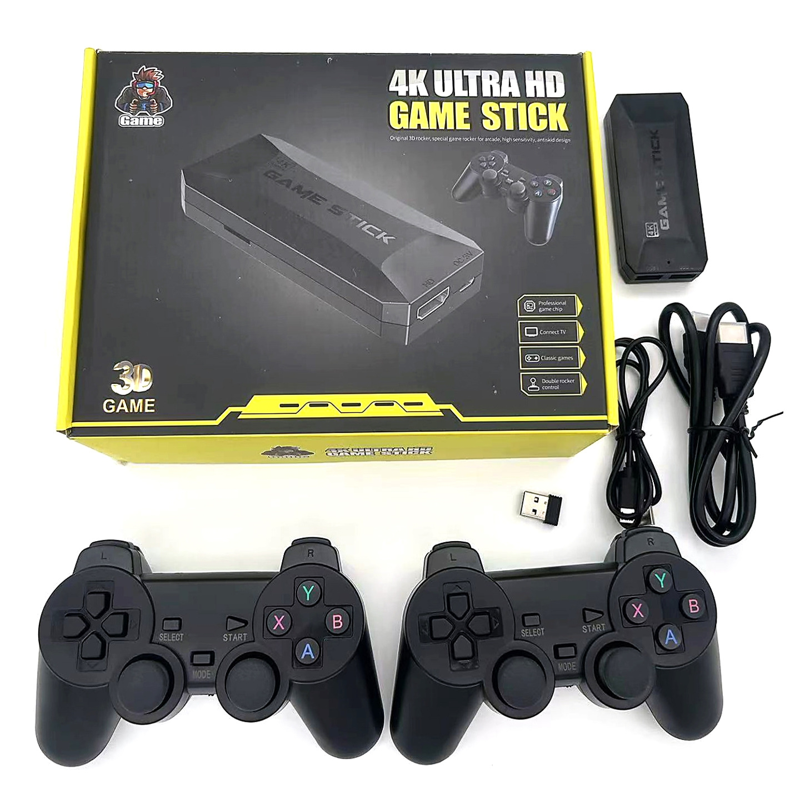

# GameStick OS Build Release

Данная сборка представляет собой версию`GameStick OS`для Game Stick M16 4K Ultra HD (Gold Stick) и является полностью собранной с нуля ОС на базе buildroot. В качестве фронтэнда используется связка EmulationStation Desktop Edition (ES-DE) и RetroArch.

Из существенных доработок можно отметить проигрывание музыки в главном меню и полное меню Retroarch в отличии от стоковой пошивки. Все сетевые функции убраны. Добавлена поддержка сторонних геймпадов. Так же реализована автоматическая разметка раздела с ROMs (как в Batocera). 
Более подробная инструкция по использованию прилагается.

Что внутри:
- `buildroot/` - подключён как git submodule и зафиксирован на проверенном commit
- `br2-external/` - product layer с конфигами и пакетами GameStick OS
- `esde/` - snapshot исходников ES-DE с текущими локальными правками
- `scripts/` - bootstrap и упаковка release-архива
- `docs/` - инструкции по сборке и пользовательская документация

Что сознательно исключено из публичного release:
- BIOS-файлы

Быстрый старт:
1. Инициализировать submodule:
   `git submodule update --init --recursive`
2. Подготовить output:
   `./scripts/init-build.sh`
   Этот шаг обязателен: скрипт автоматически накладывает локальные compatibility patches на чистый `buildroot` submodule.
3. Собрать:
   `cd output && make`

Подробные инструкции:
- [Сборка и запись](docs/BUILD.md)
- [Руководство пользователя](docs/USER_MANUAL.md)

Атрибуция bundled background music:
- набор заменён на Batocera `es-background-musics`
- лицензии и условия использования сохранены в `br2-external/package/gamestick-esde/assets/music/`
